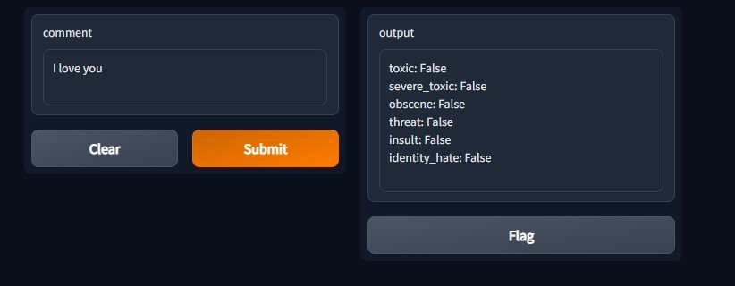
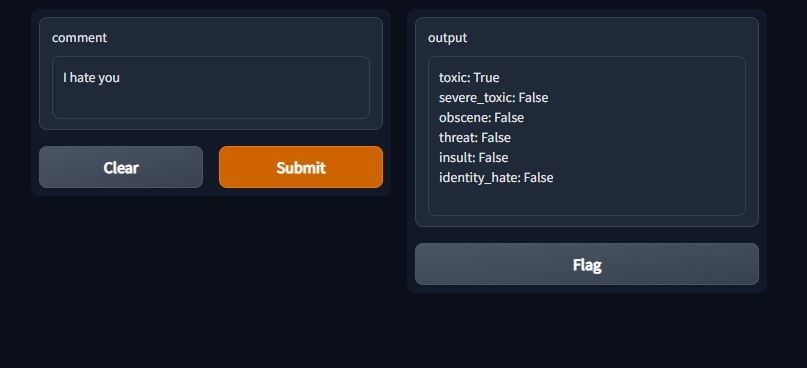

# Comment Toxicity 🧪 Detection using Deep Learning

In todays day and age, there is a lot of toxicity on a lot (most) of social media platforms, and we need a way to flag those comments, blogs, text, news, e.t.c.. In order to do that, we can ask for a helping hand from a Machine Learning Model, that can classify comments, if they are toxic or not, and if they are what is the severity of the toxicity, i.e. threat, vulgar 🗣 and much more. We need a way to filter out negative comments and make a safe environment for everybody to enjoy.

We need a datasetm that contains comments and labels about the toxicity of the comment. Kaggle to the rescue. We used this dataset to train a `LSTM` model and classify comments.

➡ `Dataset:` https://www.kaggle.com/competitions/jigsaw-toxic-comment-classification-challenge/

We are also going to create a `Gradio` application at the end, so that we can pass comments into a visual interface and with the click of a button, we can classify that comment, as more, it looks pretty to look at.

# How to run the notebook 📓 you ask ❓

To that I would say, good question. You need to install some dependeinces in order to work with this notebook.

Lets create a conda environment:

```Bash
conda create -n new_env_name python=3.7
```

Make sure you have python >=3.7, in order to use Gradio. After you have created the environment, lets activate it:

```Bash
conda activate new_env_name
```

After this, you need to install all the dependencies from the `requirements.txt` file.

```Bash
pip install -r requirements.txt
```

# Brief Introduction the Notebook 📒

▶ `Imports` will import all the necessary packages to create the model and the visualization application.

▶ `Preprocessing the Data` uses the TextVectorization from TensorFlow to tokenize the data and create numpy arrays for training, validation and testing.

▶ `Traing the Model` will create the model using `LSTM` and Keras `Sequential` API. 

⚠ Note that I have trained the model just for a single epoch, but you need to train it for atleast 10 epochs to get most accurate results.

▶ `Making prediction` will use the trained model to use the `predit()` method to make prediction.

▶ `Model Evaluation` will evaluate the trained model using `Precision`, `Recall` and `Accuracy` metrics form TensorFlow.

▶ `Saving the model` will save the trained model so that in in future we need to use that model, we need not train it again, unless you have new data to train it on.

▶ `Making a Gradio Application` will make an application using the gradio package in python which look like this:





### And that should be it, we created a Comment Toxicity Classification model, by creating a LSTM model in `TensorFlow` and created an application in `Gradio` to visualize it  ✅🏁.